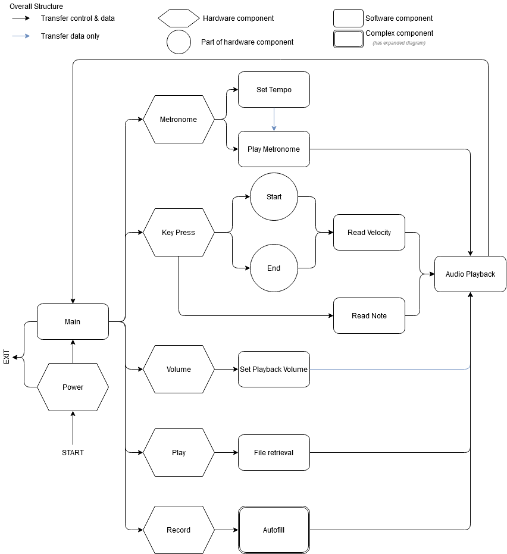
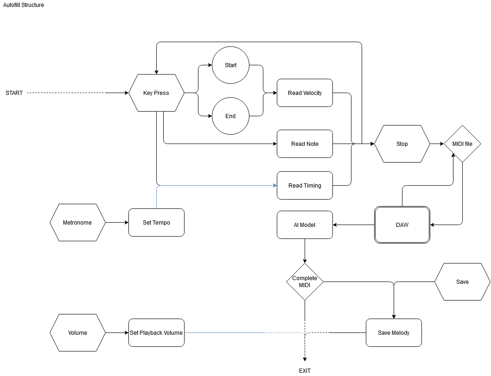
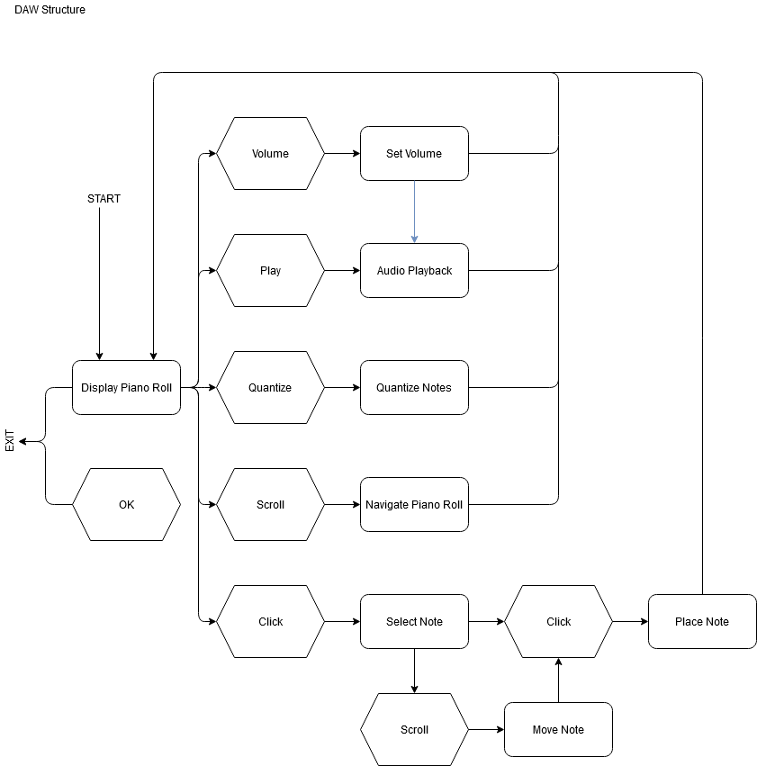

# MIDI-Autofill
## Background
All musicians know the frustration that comes with writer’s block. Whether the musician
is making music for personal enjoyment or to meet a deadline, completing a piece of music
seems to be the most difficult part of writing, even when the initial design is complete.
Our solution to musical writer’s block is a stand-alone, easy to use, portable MIDI
controller that can fill in melodic structures inputted by a user. Our concept relies heavily on
artificial intelligence and machine learning that is supported with a well-designed MIDI
controller and onboard processors. Since we do not expect any musician to be familiar with
computer or electrical engineering, our MIDI controller will have an onboard display and a user
interface similar to a Digital Audio Workstation (DAW) where the user can edit, playback, and
quantize their entries to ensure their exact musical intent before processing the melody.
Currently, we have technology that can process and continue audio through artificial
intelligence such as Jukebox AI, but this requires an understanding of computer science that not
all musicians would enjoy learning. The aim of this project, then, is to put all the technical
aspects of this human/computer collaboration on the computer side. Using Machine Learning,
we can train the computer to recognize music patterns and structures such that it could
generate a comprehensive melody at the press of a button.
## Diagrams

